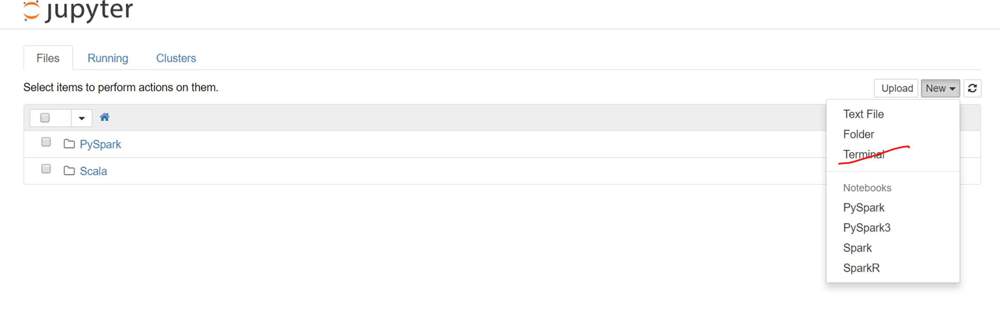

# Adding R as a Kernel on Jupyter


1. Get to head node’s terminal (either ssh or through jupyter terminal): 
	
2. Start an R Session: `R`.
3. Run the following

	```R
	r <- getOption("repos")
	mran_date <- Sys.Date() - 1
	r[["CRAN"]] <- paste0("https://mran.revolutionanalytics.com/snapshot/", mran_date)
	options(repos = r)
	install.packages(c('repr', 'IRdisplay', 'crayon', 'pbdZMQ', 'devtools', 'httr', 'curl'))
	q()
	```

3. After closing and restarting R, install `IRKernel` from GitHub

	```R
	devtools::install_github('IRkernel/IRkernel', 'hrbrmstr/hrbrthemes', 'hrbrmstr/ggalt')
	```

 
4. From jupyter’s terminal (important, not the regular terminal, as this won’t have jupyter in the path, and isn’t pointing to the conda environment that jupyter surfaces from), open R 
	`sh-4.3$ R`                                                                                                                                       
5. run the following:
```R
IRkernel::installspec()  # to register the kernel in the current R installation                                                               
```

You should now see R in the as a kernel.


